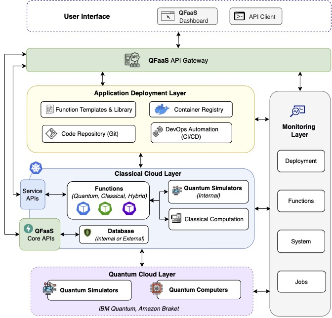

# QFaaS: A Serverless Function-as-a-Service Framework for Quantum Computing

QFaaS (Quantum Function-as-a-Service) is a full-stack framework that leverages the advantages of the serverless computing model and state-of-the-art software engineering techniques to advance practical quantum computing in the Noisy Intermediate-Scale Quantum (NISQ) era. Our framework provides essential elements of a serverless quantum system to streamline service-oriented quantum application development in cloud environments, such as combining hybrid quantum-classical computation, automating the backend selection, and adapting Quantum DevOps workflow. QFaaS offers the first full-stack and unified quantum serverless platform by integrating multiple well-known quantum software development kits (Qiskit, Q#, Cirq, and Braket), quantum simulators, and quantum cloud providers (IBM Quantum and Amazon Braket).

## QFaaS Architecture 
The architecture design of QFaaS comprises six main components: the QFaaS APIs and API Gateway, the Application Deployment Layer, the Classical Cloud Layer, the Quantum Cloud Layer, the Monitoring Layer, and the User Interface. 

## Deployment

## Reference
