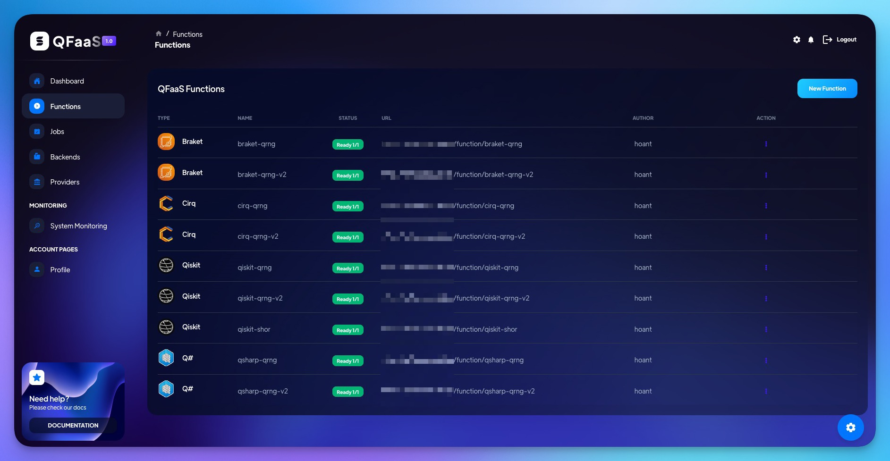

# QFaaS: A Quantum Function-as-a-Service Framework

QFaaS is a Quantum Function-as-a-Service framework that leverages the advantages of the serverless computing model and state-of-the-art software engineering techniques to advance practical quantum computing in the Noisy Intermediate-Scale Quantum (NISQ) era. Our framework provides essential elements of a serverless quantum system to streamline service-oriented quantum application development in cloud environments, such as combining hybrid quantum-classical computation, automating the backend selection, and adapting Quantum DevOps workflow. QFaaS offers the first full-stack and unified quantum serverless platform by integrating multiple well-known quantum software development kits, quantum simulators, and quantum cloud providers (IBM Quantum and Amazon Braket).

### Highlights
- Support developing quantum functions using 4 popular quantum SDKs, including Qiskit, Q#, Cirq, and Braket.
- Built-in APIs with API gateway to manage system components, quantum functions, jobs, quantum backend and providers.
- Simplify quantum programming and enable hybrid quantum-classical function development with built-in Python library.
- Execute quantum functions on both internal quantum simulators and external quantum computers/simulators from IBM Quantum and Strangeworks Quantum Computing platforms (Amazon Braket).

### QFaaS Architecture 
The architecture design of QFaaS comprises six main components: the QFaaS APIs and API Gateway, the Application Deployment Layer, the Classical Cloud Layer, the Quantum Cloud Layer, the Monitoring Layer, and the User Interface. 

## Contributing

Pull requests are welcome. For major changes, please open an issue first
to discuss what you would like to change.

Please make sure to update tests as appropriate.

### Reference
[1] Hoa T. Nguyen, Muhammad Usman, and Rajkumar Buyya, “QFaaS: A Serverless Function-as-a-Service framework for Quantum computing,” Future Generation Computer Systems, vol. 154. Elsevier BV, pp. 281–300, May 2024. doi: 10.1016/j.future.2024.01.018. Available: [http://dx.doi.org/10.1016/j.future.2024.01.018](http://dx.doi.org/10.1016/j.future.2024.01.018)

## License

[GNU GPLv3](https://choosealicense.com/licenses/gpl-3.0/)
